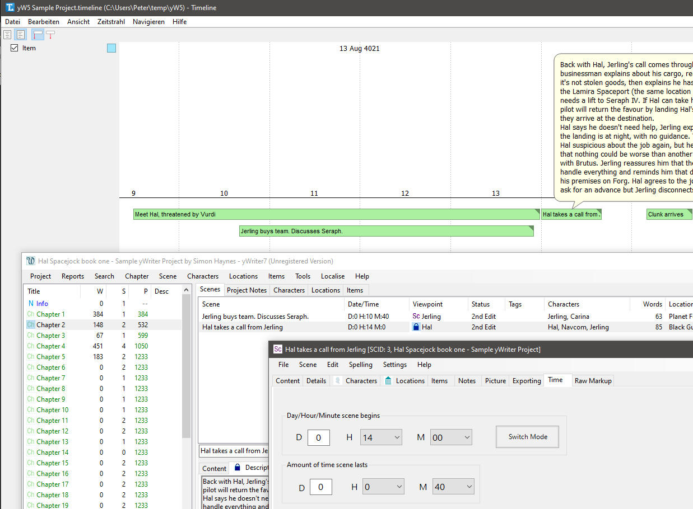

The [Timeline Project](http://thetimelineproj.sourceforge.net/) application 
can be used to visualize the course of the narrative time in a 
[yWriter](http://spacejock.com/yWriter7.html) project.

## Features

- Generate a *yWriter* project from an outline created with *Timeline*.
- Generate a *Timeline* project from a *yWriter* project.
- Synchronize *yWriter* scenes with corresponding *Timeline* events in both directions.
- When synchronizing a yWriter project with a timeline, optionally change unspecific scene "Day/Hour/Minute" to specific "date/time" and vice versa.
- Launch via drag/drop or Windows context menu.
- Optionally, a [novelyst](https://peter88213.github.io/novelyst/) plugin can be installed.

 
## Requirements

- [Python 3.7 or above](https://www.python.org). 
- [yWriter 7](http://spacejock.com/yWriter7.html). Recent versions 5 or 6 might also work if they save in .yw7 file format.
- [Timeline 2.4 or 2.5](https://sourceforge.net/projects/thetimelineproj/). Versions below 2.4 do not support labels, which are necessary for synchronization with yWriter.

## Download and install

[Download the latest release (version 1.4.1)](https://raw.githubusercontent.com/peter88213/yw-timeline/main/dist/yw-timeline_v1.4.1.zip)

- Unzip the downloaded zipfile "yw-timeline_v1.4.1.zip" into a new folder.
- Move into this new folder and launch **setup.pyw**. This installs the script for the local user.
- Create a shortcut on the desktop when asked.
- Open "README.md" for usage instructions.

### Note for Linux users

Please make sure that your Python3 installation has the *tkinter* module. On Ubuntu, for example, it is not available out of the box and must be installed via a separate package. 

------------------------------------------------------------------

[Changelog](changelog)

## Usage and conventions

See the [instructions for use](usage)

## Credits

- Frederik Lundh published the [xml pretty print algorithm](http://effbot.org/zone/element-lib.htm#prettyprint).

## License

yw-timeline is distributed under the [MIT License](http://www.opensource.org/licenses/mit-license.php).

 

